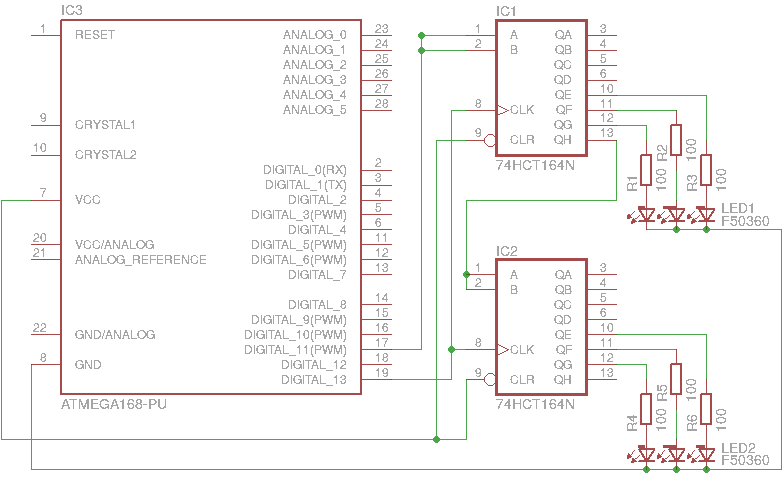

Cheap RGB lanterns
==================

The aim of this project is to put RGB LEDs into lanterns in a cheap way that
still allows setting an individual color for each lantern. The current plan
uses a shift register and a single RGB LED per lantern, resulting in 1 EUR
cost per lamp approximately.

Signal lines
------------

 - *GND* Ground (same everywhere)
 - *VCC* Power supply (same everywhere)
 - *CLK* Clock (same everywhere)
 - *BIT* Data (output on controller, Q7 on shiftreg)

Shift register pinout
---------------------

 - 2 bits for everything (leaves 2 spare pins)
 - 3 bits for red and green, 2 bits for blue ([256 colors][256c])

For DAC, [R-2R resistor ladder][r2r] could be used.

  [256c]: https://en.wikipedia.org/wiki/8-bit_color
  [r2r]: https://en.wikipedia.org/wiki/Resistor_ladder
